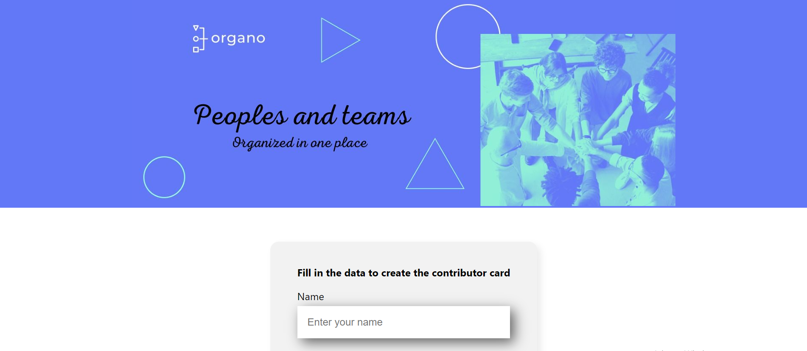

  
  
  

    

# Team Builder -A Application for Creating Technology Teams

Welcome to Team Builder, a powerful and intuitive application designed to help you create and manage teams of professionals across various technology domains. This project is built using the React framework and leverages JavaScript to provide a seamless and interactive user experience.

## Project Overview

Team Builder is your go-to tool for assembling and organizing teams of experts in different areas of technology. Whether you're managing a software development project, a data science initiative, or a cybersecurity task force, Team Builder simplifies the process of team creation and management.

## Features

- **Intuitive User Interface:** A clean and user-friendly interface that makes it easy to navigate and use the application.
- **Team Creation:** Quickly create teams by adding members with specific roles and skills.
- **Role Assignment:** Assign roles such as developer, designer, data scientist, project manager, and more to team members.
- **Skill Management:** Define and manage the skills required for each role to ensure your team has the necessary expertise.
- **Dynamic Updates:** Real-time updates and changes to team composition, ensuring you always have the most accurate information.
- **Collaboration Tools:** Integrated features that promote collaboration and communication within the team.

## Technical Details

- **Framework:** React, a popular JavaScript library for building user interfaces.
- **Language:** JavaScript, ensuring high performance and flexibility.
- **State Management:** Utilizes React's state management capabilities to handle dynamic data and user interactions.
- **Styling:** Modern CSS techniques to create a visually appealing and responsive design.

## Learning Experience

Developing Team Builder was an enriching experience that deepened my understanding of React and modern JavaScript development. Through this project, I gained practical experience in:

- **Component-Based Architecture:** Building reusable and modular components to streamline development and maintenance.
- **State Management:** Effectively managing application state using React's hooks and context API.
- **Responsive Design:** Implementing responsive design principles to ensure a great user experience on both desktop and mobile devices.
- **API Consumption:** Integrating and working with external APIs to enhance functionality and data availability.

## Try It Out

Explore the Team Builder application and see how it can help you streamline the process of creating and managing technology teams.

<h1>NPM START</h1>

I'm excited to continue enhancing this project and adding new features to meet the evolving needs of team management. Stay tuned for more updates and improvements!

